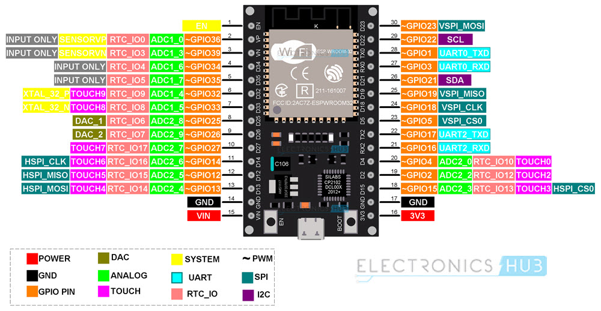

# Guía de Desarrollo Profesional para ESP32 (ESP-IDF)

Bienvenido a esta guía de referencia rápida (*CheatSheet*) y mejores prácticas para el desarrollo de firmware embebido utilizando el framework oficial de Espressif (**ESP-IDF**).

Este documento está diseñado para ingenieros y desarrolladores que buscan migrar de Arduino a un entorno profesional o necesitan recordar rápidamente la sintaxis y funciones clave del ESP32.

> **Repositorio de Ejemplos:** [GitHub - ESP-IDF-Examples](https://github.com/tvecchiUTN/ESP-IDF-Examples/tree/main)

---

## ⚡ Antes de empezar: El Hardware (ESP32)

El ESP32 es mucho más potente que un Arduino estándar, pero tiene reglas estrictas:

* **Voltaje Lógico:** **3.3V**. ¡Cuidado! Conectar sensores de 5V directamente a los pines quemará el chip.
* **Núcleos:** Cuenta con 2 núcleos (Core 0 y Core 1).
    * *Core 0:* Se encarga del WiFi y Bluetooth (Radio).
    * *Core 1:* Ejecuta tu código (`app_main`).
* **Corriente:** Los pines GPIO pueden entregar máximo **12mA** (suficiente para un LED, no para motores).

---

## 🛠️ Filosofía ESP-IDF vs Arduino

En este framework, el control es tuyo. Ten en cuenta estas diferencias vitales:

1.  **No existe el `loop()` infinito:**
    * Tu código corre en una tarea de **FreeRTOS**.
    * **Regla de Oro:** Nunca hagas bucles vacíos (`while(1){}`). Siempre debes ceder el control con `vTaskDelay` para evitar que el *Watchdog Timer* reinicie el chip por sospecha de bloqueo.

2.  **Manejo de Errores (Obligatorio):**
    * Casi todas las funciones retornan `esp_err_t` (un código de error).
    * **Usa siempre:** `ESP_ERROR_CHECK(funcion())`. Si la función falla, el ESP32 se reiniciará y te imprimirá el error exacto en la consola. ¡No ignores los errores!

3.  **Logs > Serial.print:**
    * Usamos la librería de logging (`ESP_LOGI`, `ESP_LOGE`) que permite colorear, etiquetar y desactivar mensajes por niveles globalmente.

---

## 📚 Índice de Soluciones

### 🟢 [Parte 1: Hardware y Periféricos](./Documentacion/Parte1_Basicos.md)
*Lo esencial para controlar el mundo físico.*

| Quiero... | Ir a Sección |
| :--- | :--- |
| Configurar pines (Led, Botón) | [GPIO](./Documentacion/Parte1_Basicos.md#gpio-general-purpose-input-output) |
| Leer voltaje analógico | [ADC](./Documentacion/Parte1_Basicos.md#adc-analog-digital-converter) |
| Controlar intensidad/Servos | [PWM](./Documentacion/Parte1_Basicos.md#pwm-pulse-widht-modulation) |
| Guardar datos sin perderlos | [NVS](./Documentacion/Parte1_Basicos.md#nvs-non-volatile-storage) |
| Comunicar con PC/Sensores | [UART](./Documentacion/Parte1_Basicos.md#uart-universal-asynchronous-receiver-transmitter) |
| Ahorrar batería | [Power Modes](./Documentacion/Parte1_Basicos.md#power-modes) |

### 🟡 [Parte 2: Sistema Operativo (FreeRTOS)](./Documentacion/Parte2_FreeRTOS.md)
*Gestión de tareas y tiempos.*

| Quiero... | Ir a Sección |
| :--- | :--- |
| **Ejecutar código en paralelo** | [Creación de Tareas](./Documentacion/Parte2_FreeRTOS.md#creacion-de-tareas-task-create) |
| **Pasar datos** entre tareas | [Colas (Queues)](./Documentacion/Parte2_FreeRTOS.md#colas-o-queue) |
| **Proteger** una variable global | [Mutex](./Documentacion/Parte2_FreeRTOS.md#semaforos-y-mutex) |
| **Sincronizar** (Avisar que algo pasó) | [Semáforos](./Documentacion/Parte2_FreeRTOS.md#semaforos-y-mutex) |
| **Avisar** desde una interrupción (Rápido) | [Notificaciones Directas](./Documentacion/Parte2_FreeRTOS.md#notificaciones-directas-task-notifications) |
| Esperar **múltiples** eventos a la vez | [Grupos de Eventos](./Documentacion/Parte2_FreeRTOS.md#grupos-de-eventos) |

### 🔵 [Parte 3: Conectividad y Protocolos](./Documentacion/Parte3_Conectividad.md)
*Conectando al mundo (IoT).*
* **WiFi Station:** Conectarse a un Router.
* **WiFi SoftAP:** Crear tu propia red.
* **Protocolos:** HTTP Client, MQTT.
* **Hardware:** I2C, SPI.

---

## 💡 Recomendaciones Finales

* **Documentación Oficial:** Esta guía es un resumen. Para detalles profundos, siempre consulta la [API Reference de Espressif](https://docs.espressif.com/projects/esp-idf/en/stable/esp32/api-reference/index.html).
* **Monitor:** Mantén siempre abierto el monitor serie (`idf.py monitor`) para ver los logs y trazas de error (Backtrace) cuando ocurra un *Crash*.

## PinOut del ESP32

